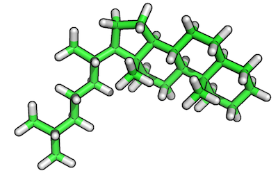

#Substructure Alignment Using OpenEye OEChem RMSD

## 1) Extract substructure in PyMOL
Open the mol2 file of the reference molecule in PyMOL and extract the substructure you want to align to the query molecules (save it as PDB).

#### Reference molecule

#### Reference substructure

## 2) Convert substructure into SMILES 

Use the free online SMILES translator at [http://cactus.nci.nih.gov/translate/] (http://cactus.nci.nih.gov/translate/) convert the substructure PDB into a SMILES string

## 3) Use OpenEye's RMSD tool

Run OpenEye's RMSD tool to align the query structure(s) to the substructure and write out the aligned structure.

E.g., 

	/soft/linux64/openeye/.../oechem-utilities/rmsd\
	-in /home/.../ query.mol2\ 
	-ref ~/Desktop/reference_molecule.mol2\
	-overlay\
	-out /home/.../3KPZS_27.mol2\ 	
	-automorph false\
	-smarts C1CCC2C(C1)CCC3C4CCCC4CCC2

**Tip:**  
If your query is a multimol2-file, you can use the Python script [./Scripts/split_multimol2.py](split_multimol2.py) to split it into individual mol2 files:

	USAGE: python3 multimol2.mol2 output_directory

And to automate the RMSD substructure alignment over the individual mol2 files, you can use the script [multimol2_rmsd_align.py](./Scripts/multimol2_rmsd_align.py) where you just have to modify the path to your OpenEye RMSD executable.

	USAGE: python3 mmol2_rmsd_align.py input_dir/ output_dir/ ref.mol2

Finally, you can concatenate the resulting alignments back into one single multi-mol2 file via

	> cat mol2_dir/*.mol2 > my_multimol2 file