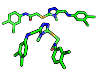
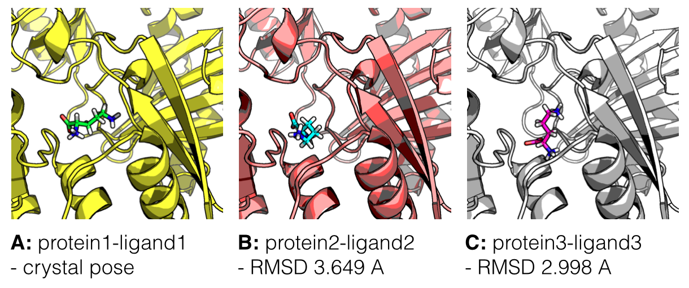
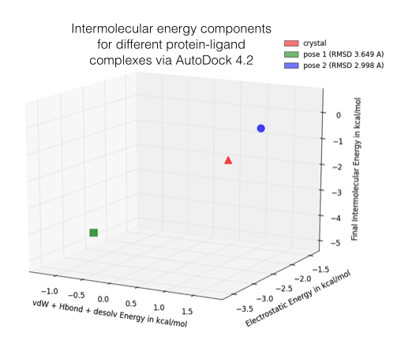
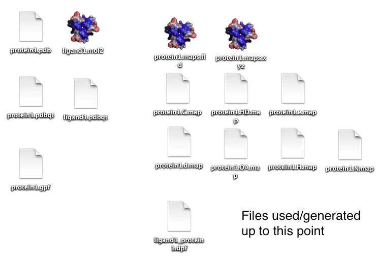
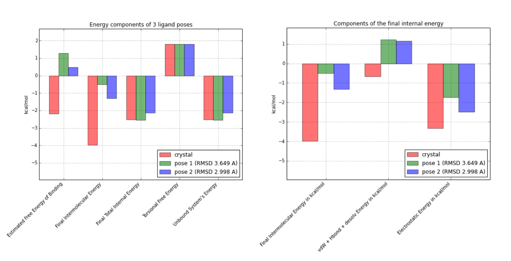

Sebastian Raschka  
Last updated: 07/26/2014

# Molecular docking, estimating free energies of binding, and AutoDock's semi-empirical force field

## Table of Contents

- [Introduction](#introduction)
    - [Molecular Docking](#molecular-docking)
	- [About AutoDock](#about-autodock)
- [Steps for estimating binding energies via AutoDock 4.2](##steps-for-estimating-binding-energies-via-autodock-42)
    - [Setup](#setup)
    - [1) Preparing a protein](#1-preparing-a-protein)
    - [2) Preparing a ligand](#2-preparing-a-ligand)
    - [3) Generating a grid parameter file](#3-generating-a-grid-parameter-file)
    - [4) Generating maps and grid data files](#4-generating-maps-and-grid-data-files)
    - [5) Generating a docking parameter file](#5-generating-a-docking-parameter-file)
    - [6) Running AutoDock](#6-running-autodock)
    - [7) Results](#7-results)
- [Other scoring functions and tools](#other-scoring-functions-and-tools)
    - [AutoDock Vina](#autodock-vina)
    - [DrugScoreX](#drugscorex)
    - [LigScore](#ligscore)

 
Discussions and questions about methods, approaches, and tools for estimating (relative) free binding energies of protein-ligand complexes are quite popular, and even the simplest tools can be quite tricky to use. Here, I want to briefly summarize the idea of molecular docking, and give a short overview about how we can use AutoDock 4.2's hybrid approach for evaluating binding affinities.  
 

I would be happy to hear your comments and suggestions. 
Please feel free to drop me a note via
[twitter](https://twitter.com/rasbt), [email](mailto:bluewoodtree@gmail.com), or [google+](https://plus.google.com/+SebastianRaschka).

 
 

# Introduction
[[back to top](#table-of-contents)]

 
 

## Molecular Docking
[[back to top](#table-of-contents)]

Typically, the goals of molecular docking are the identification of a ligand that binds to a specific receptor binding site and the identification of its preferred, energetically most favorable, binding pose. Where the term "binding pose" considers the orientation of a ligand relative to its receptor as well as the ligand's conformation.  
In order to accomplish this task, molecular docking tools will generate a set of different ligand binding poses and use a scoring function to estimate binding affinities for the generated ligand poses  in order to determine the best binding mode.

 
 

 

**Ligand Orientation**:

In contrast to "conformation", the bond angles are the same between two/multiple ligands (as well as the chemical composition), but the orientation in space (transition, global rotation) is differs between two/multiple orientations.

 

**Ligand Conformation**:

- Ligands/proteins can exist in different conformations. Usually, "conformation" refers to the same chemical composition but with altered bond-angles between two/multiple ligands or proteins.

 

**Ligand Pose**:

A ligand pose describes the binding-mode of a ligand in a protein binding site. Typically, this is considered to be a combination of orientation and conformation.

 

 
 

Depending on the application, the a ligand of interest can either act as a receptor agonist - a molecule that triggers a response in a biological system upon binding - or a receptor antagonist, which is a molecule that suppresses the agonist mediated response, respectively.
In practice, often a large library of small drug-like compounds has to be screened in order to identify a promising lead compound. Thus, not only accuracy, but also computational efficiency is a major concern in the development of molecular docking software.

The different approaches used by current molecular docking tools and scoring functions can be roughly put into one of the following categories:

1. detailed molecular dynamics with implicit or explicit solvent models that calculate absolute values of the free energies of binding 
2. knowledge-based statistical potentials trained on protein-ligand complexes from protein structure databases such as [PDB](http://www.rcsb.org) or [CSD](http://www.ccdc.cam.ac.uk/Solutions/CSDSystem/Pages/CSD.aspx)
3. empirical approaches that take a regression-based approach for fitting experimental data (e.g., from data bases like [PDBbind](http://www.pdbbind.org.cn))

Also here, it depends on the application which tool to prefer: For a small set of different ligand-protein complexes, the more computationally expensive force-field-based methods can provide more detailed insights, whereas knowledge-based and empirical approaches aim more for high-throughput.   
Usually, tools from the categories 2 and 3 are calculating binding affinities as relative quantities, suitable for ranking, and in contrast, force-field based approaches try to estimate the absolute free binding energies (e.g., calculated as kcal/mol of kJ/mol, respectively). 
Note that although the non-molecular-dynamics-based approaches are more focussed on simplicity and computational efficiency, this does not necessarily imply a lower accuracy in the relative ranking of the evaluated protein-ligand complexes.

For the following sections, we will be assuming that we've already generated a set of protein-ligand complexes, where different ligand poses were docked ("positioned") into the same (or analogous) binding site of a protein. 

In the figure below, I am showing 2 exemplary docking poses that I generated, next to the ligand binding pose of L-Ornithin that was [observed experimentally](http://www.rcsb.org/pdb/explore/explore.do?structureId=1A9X) via X-ray crystallography.

For the evaluation of a scoring function, an experimentally observed protein-ligand complex can be used as a positive control: Ideally, the generated ligand poses that are closest to the experimental structure should be ranked highest.  
In order to quantify the similarity between a native ligand and a generated ligand pose, the  RMSD (Root-mean square deviation) can be calculated between both structures: The RMSD measures the average distance between atoms of 2 protein or ligand structures via the simple equation

	
where *ai* refers to the atoms of molecule 1, and *bi* to the atoms of molecule 2, respectively. The subscripts *x, y, z* are denoting the x-y-z coordinates for every atom.	

Of course,  the native ligand pose is not available in a real application, but this simple RMSD measure with the crystal pose as reference is quite useful to train, test, and compare different scoring functions. 

For any kind of analysis that involves the the prediction of binding energies, we have to keep in mind that this task is still very challenging, and there are many different methods and approaches (statistical potentials, molecular mechanics/dynamics, experimental data, etc.) that provide estimates with varying accuracies. 

Also, please keep in mind that the following approach might only make sense when we are comparing analogous structures, e.g., different ligand poses docked into the same protein binding sites for a relative ranking. Due to shortcomings, assumptions, and simplifications, **I neither recommend this approach to use the estimated energies as absolute values nor to compare them across different proteins.**

The list of things to be considered during a free binding energy calculation is almost endless, starting with the quality of the available 3D (crystal/NMR) structure. Other important things to consider are, e.g., the method of sampling of the conformational changes when the ligand binds to the protein, the modeling of water molecules and ions, or the correct prediction of protonation states considering local pKa values and pKa shifts upon binding ...

The free energy of binding that we will attempt to estimate is calculated as &Delta;Gbind = &Delta;H - T&Delta;S,   
where the &Delta;H represents the enthalpic, and T&Delta;S the entropic contribution (only a negative &Delta;G value is energetically favorable).   
Typically, if a ligand binds to a protein, the enthalpic term decreases due to favorable intermolecular interactions and formation of intermolecular bonds (although solvation energy and interaction with water molecules plays a significant role too), whereas the entropic term tends to increase due to e.g., loss of degrees of freedom.
 
 
 

## About AutoDock
[[back to top](#table-of-contents)]

AutoDock uses a computationally (relatively) inexpensive "hybrid" force field that contains terms based on molecular mechanics as well as empirical terms. The prediction of absolute binding energies may be less accurate compared to more computationally expensive, purely force field-based methods, but this semi-empirical approach is considered as well-suited for the relative rankings.

The AutoDock semi-empirical force field includes intramolecular terms, a "full" desolvation model, and also considers directionality in hydrogen bonds. The conformational entropy is calculated from the sum of the torsional degrees of freedom.  Water molecules are not modeled explicitly though, but pair-wise atomic terms are used to estimate the water contribution (dispersion/repulsion, hydrogen bonding, electrostatics, and desolvation), where weights are added for calibration (based on experimental data).  
The evaluation step in a nutshell: firstly, calculate the energy of ligand and protein in the unbound state. Secondly, calculate the energy of the protein-ligand complex. Then take the difference between 1 and 2.

Where *P* refers to the protein, *L* refers to the ligand, *V* are the pair-wise evaluations mentioned above, and &Delta;Sconf denotes the loss of conformational entropy upon binding (R Huey et al., 2006 1).

1 Huey, Ruth, Garrett M. Morris, Arthur J. Olson, and David S. Goodsell. [“A Semiempirical Free Energy Force Field with Charge-Based Desolvation.”](http://onlinelibrary.wiley.com/doi/10.1002/jcc.20634/abstract) Journal of Computational Chemistry 28, no. 6 (April 30, 2007): 1145–52. doi:10.1002/jcc.20634.

 
 

# Steps for estimating binding energies via AutoDock 4.2
[[back to top](#table-of-contents)]

 
 

## Setup
[[back to top](#table-of-contents)]

For the following steps, we will need the following tools:

- [AutoDock 4.2](http://autodock.scripps.edu/downloads/autodock-registration/autodock-4-2-download-page/)
- [MGLTools](http://mgltools.scripps.edu)

AutoDock 4.2 is freely available for [download](http://autodock.scripps.edu/downloads/autodock-registration/autodock-4-2-download-page/) and under GNU GPL license. The installation is really simple: On MacOS or Linux, all you need to do is to move the downloaded binaries `autodock4` and `autogrid4` to your `/usr/local/bin` directory. For more information, please see the more detailed instructions on [this page](http://autodock.scripps.edu/downloads/autodock-registration/autodock-4-2-download-page/).

[MGLTools](http://mgltools.scripps.edu/downloads) is a quite large package of different tools and GUIs for working with molecular structures, including AutoDockTools. Here, we will only need 2 Python scripts for preparing the protein and ligand structure files for AutoDock.    
Alternatively, we could also use  [OpenBabel](http://openbabel.org/wiki/Main_Page) to generate the required input PDBQT files ([usage example](https://github.com/rasbt/protein-science/blob/master/scripts-and-tools/more_protein-science_tools.md#openbabel)).

 
 

## 1) Preparing a protein
[[back to top](#table-of-contents)]

In this step, we will create a PDBQT file of our protein (or receptor) that contains hydrogen atoms, as well as partial charges.

There are many different existing methods to estimate partial charges. Using the following procedure, we will use the so-called "Gasteiger charges". Gasteiger charges are based on an empirical scheme that only requires knowledge of the topology of an molecule and are therefore popular for its simple and fast computation (J. Gasteiger, M. Marsili, 1980 2).

Typically, assuming that we already performed a molecular docking, we have the protein structure file in PDB format with hydrogen atoms already added. Otherwise you can just append the `-A "hydrogens"` flag to the following command that we will be using to prepare the receptor PDBQT file.  
There are many tools to add hydrogen atoms to a protein, one popular alternative would be "Reduce" (you can find the reference and usage examples [here](https://github.com/rasbt/protein-science/blob/master/scripts-and-tools/more_protein-science_tools.md#reduce)).

2 Gasteiger, Johann, and Mario Marsili. [“Iterative Partial Equalization of Orbital Electronegativity—a Rapid Access to Atomic Charges.”](http://www.sciencedirect.com/science/article/pii/0040402080801682#) Tetrahedron 36, no. 22 (1980): 3219–28. doi:10.1016/0040-4020(80)80168-2.

 

- **Input:**  

		protein.pdb

 

- **Output:**   

		protein.pdbqt

 

- **Command:**   

		prepare_receptor4.py -r protein.pdb [options]
		# -A "hydrogens" (to add hydrogen atoms if not present)

 

- **Example**: 

		/Library/MGLTools/1.5.6/bin/pythonsh /Library/MGLTools/1.5.6/MGLToolsPckgs/AutoDockTools/Utilities24/prepare_receptor4.py -r protein.pdb 

 
		
For more information, please see the documentation at [http://autodock.scripps.edu/faqs-help/how-to/how-to-prepare-a-receptor-file-for-autodock4](http://autodock.scripps.edu/faqs-help/how-to/how-to-prepare-a-receptor-file-for-autodock4).

 
 

## 2) Preparing a ligand
[[back to top](#table-of-contents)]

This step is quite similar to the preparation of the receptor (see step 1). Also here, we create a PDBQT file from a ligand molecule, which could e.g., MOL2 or PDB format.  
Typically, I have my ligand molecules in MOL2 format after adding hydrogen atoms and AM1-BCC charges (Jakalian et al., 2002 3) via the AMBER force field.  However, I found in practice, that AutoDock4.2 re-scoring has a slightly higher accuracy (for scoring poses well that are close to the native state) when I let the `prepare_ligand4.py` script reassign hydrogen atoms and Gasteiger charges.

3  Jakalian, Araz, David B. Jack, and Christopher I. Bayly. [“Fast, Efficient Generation of High-Quality Atomic Charges. AM1-BCC Model: II. Parameterization and Validation.”](http://onlinelibrary.wiley.com/doi/10.1002/jcc.10128/abstract) Journal of Computational Chemistry 23, no. 16 (October 18, 2002): 1623–41. doi:10.1002/jcc.10128.

 

- **Input:**   

		ligand.pdb or ligand.mol2

 

- **Output:**  

		ligand.pdbqt

 

- **Command:** 

		prepare_ligand4.py -l ligand.mol2 [options]
		# -C -U "" (to preserve existing hydrogens and charges)

 

- **Example**:  

		/Library/MGLTools/1.5.6/bin/pythonsh /Library/MGLTools/1.5.6/MGLToolsPckgs/AutoDockTools/Utilities24/prepare_ligand4.py -l ligand.mol2

 

For more information, please see the documentation at [http://autodock.scripps.edu/faqs-help/how-to/how-to-prepare-a-ligand-file-for-autodock4](http://autodock.scripps.edu/faqs-help/how-to/how-to-prepare-a-ligand-file-for-autodock4).

 
 

## 3) Generating a grid parameter file
[[back to top](#table-of-contents)]

Now, we have to define the 3D space that AutoDock considers for the docking, typically, a volume around a the potential binding site of a receptor. Since we already have a "positioned" ligand in our case, we can center the grid at the ligand's center by using the `-y` flag.

In this step, we will create the input file for "AutoGrid4", which will create different "map" files and the grid data file as we will see in the next section.

Note that although we don't want to perform a docking here, just a "re-scoring" of already docked complexes, we still need to go through this steps for the AutoDock re-scoring to work.

 

- **Input:**   

		ligand.pdbqt
		protein.pdbqt

 

- **Output:**  

		protein.gpf

 

- **Command:** 

		prepare_gpf4.py -l ligand.pdbqt -r protein.pdbqt -y [options]

 

- **Example**:  
	
		/Library/MGLTools/1.5.6/bin/pythonsh /Library/MGLTools/1.5.6/MGLToolsPckgs/AutoDockTools/Utilities24/prepare_gpf4.py -l ligand.pdbqt -r protein.pdbqt -y

 

For more information, please see the documentation at [http://autodock.scripps.edu/faqs-help/how-to/how-to-prepare-a-grid-parameter-files-for-autogrid4](http://autodock.scripps.edu/faqs-help/how-to/how-to-prepare-a-grid-parameter-files-for-autogrid4).

 
 

## 4) Generating maps and grid data files
[[back to top](#table-of-contents)]

We created the grid parameter file in the previous step, and now we can use AutoGrid4.2 to generate a bunch of different map files and the main grid data file.

 

- **Input:**   

		protein.pdbqt 
		protein.gpf

 

- **Output:**  

		protein.*.map		# affinity maps for different atoms
		protein.maps.fld	# Grid data file
		protein.d.map		# desolvation map
		protein.e.map		# electrostatic map

 

- **Command:** 

		autogrid4 -p protein.gpf

 

- **More usage information:**

		usage: AutoGrid 	-p parameter_filename
			-l log_filename
			-d (increment debug level)
			-h (display this message)
			--version (print version information, copyright, and license)

 
 

## 5) Generating a docking parameter file
[[back to top](#table-of-contents)]

We are almost there! The last before we can run the actual re-scoring is to prepare the docking parameter file that bundles the information that is required by AutoDock. 

 

- **Input:**   

		ligand.pdbqt
		protein.pdbqt

 

- **Output:**  

		ligand_protein.dpf

 

- **Command:** 

		prepare_dpf4.py -l ligand.pdbqt -r protein.pdbqt [options]

 		
		
- **Example**:  

		/Library/MGLTools/1.5.6/bin/pythonsh /Library/MGLTools/1.5.6/MGLToolsPckgs/AutoDockTools/Utilities24/prepare_dpf4.py -l ligand.pdbqt -r protein.pdbqt

 		
	
For more information, please see the documentation at [http://autodock.scripps.edu/faqs-help/how-to/how-to-prepare-a-docking-parameter-file-for-autodock4-1](http://autodock.scripps.edu/faqs-help/how-to/how-to-prepare-a-docking-parameter-file-for-autodock4-1).	
 		
		
**A crucial step after we obtained the docking parameter file is to modify it so that AutoDock re-scores it, instead of performing a docking.**

This is actually pretty straight forward, we just have to remove all lines that are involved in the docking procedure, and append the parameter `epdb`.

So, the modified docking parameter file could look like this:

	autodock_parameter_version 4.2	# used by autodock to validate parameter set
	outlev 1						# diagnostic output level
	intelec							# calculate internal electrostatics
	ligand_types C H HD N OA		# atoms types in ligand
	fld protein.maps.fld			# grid_data_file
	map protein.C.map				# atom-specific affinity map
	map protein.H.map				# atom-specific affinity map
	map protein.HD.map				# atom-specific affinity map
	map protein.N.map				# atom-specific affinity map
	map protein.OA.map				# atom-specific affinity map
	elecmap protein.e.map			# electrostatics map
	desolvmap protein.d.map			# desolvation map
	move ligand.pdbqt				# small molecule
	about 32.7295 15.019 52.7701	# small molecule center
	epdb							# **add** this to evaluate the small molecule

 
 

## 6) Running AutoDock
[[back to top](#table-of-contents)]

At this point, we should have created a whole bunch of different files and should be ready to score the protein-ligand complex.

- **Input:**   

		ligand_protein.dpf

- **Output:**  

		scoring_result.log

- **Command:** 

		autodock4 -p ligand_protein.dpf -l scoring_result.log

 
 

## 7) Results
[[back to top](#table-of-contents)]

After AutoDock has completed the re-scoring successfully, we should see the results in the log-file, which should look as follows:

 

	AutoDock 4.2 Release 4.2.5.1 
	(C) 1989-2012 The Scripps Research Institute
	AutoDock comes with ABSOLUTELY NO WARRANTY.
	AutoDock is free software, and you are welcome
	to redistribute it under certain conditions;
	for details type 'autodock4 -C'
	[...]
        
	Total Intermolecular Interaction Energy          =  -3.1862 kcal/mol
	Total Intermolecular vdW + Hbond + desolv Energy =  -0.2499 kcal/mol
	Total Intermolecular Electrostatic Energy        =  -2.9362 kcal/mol
	Total Intermolecular + Intramolecular Energy     =  -5.6314 kcal/mol

	epdb: USER    Estimated Free Energy of Binding    =   -1.40 kcal/mol  [=(1)+(2)+(3)-(4)]
	epdb: USER    Estimated Inhibition Constant, Ki   =   94.72 mM (millimolar)  [Temperature = 298.15 K]
	epdb: USER    
	epdb: USER    (1) Final Intermolecular Energy     =   -3.19 kcal/mol
	epdb: USER        vdW + Hbond + desolv Energy     =   -0.25 kcal/mol
	epdb: USER        Electrostatic Energy            =   -2.94 kcal/mol
	epdb: USER    (2) Final Total Internal Energy     =   -2.45 kcal/mol
	epdb: USER    (3) Torsional Free Energy           =   +1.79 kcal/mol
	epdb: USER    (4) Unbound System's Energy  [=(2)] =   -2.45 kcal/mol
  

At the very bottom, we can see the estimated free energy of binding along with the other component that are included in the calculation of the former. 

If we'd automate the process for a bunch of ligand poses, we have some data for all kinds of analyses. Below, I repeated the process for two "bad" ligand poses that were obtained by docking the crystal structure. 

	

As we can see in the bar plot above (left), the estimated free energy of binding is only favorable (i.e., negative) for the crystal structure pose, where the intermolecular energy is the determining term here. If we break the estimated intermolecular free energy further down (right bar plot), we can speculate that unfavorable van der Waals radii and/or a weaker hydrogen-bond network might be responsible for the energy difference between the crystal state and the generated docking poses.

 
 
 

# Other scoring functions and tools
[[back to top](#table-of-contents)]

Below, I just want to list a few other tools for scoring a set of protein-ligand complexes. Those are mainly based on statistical potentials rather than on physics. Being computational efficient, their usefulness lies in the high-throughput evaluation of different ligand poses in the same or analogous protein binding interface.  

 
 

## AutoDock Vina
[[back to top](#table-of-contents)]

Vina is considered to be the successor of AutoDock4.2 and comes with a new knowledge-based, statistical scoring function that replaces the semiempirical force field of AutoDock. The advantages of Vina over AutoDock4.2 are its improved prediction accuracy and speed, which is not only due to the simplification of the scoring function, but also due to the capability of multi-threading in presence of multiple CPU cores.

While the simplified scoring function still attempts to estimate free energies of binding in kcal/mol, the individual terms, such as hydrophobic contribution and hydrogen bonding are only provided as relative weights in the output. 

Website: [http://vina.scripps.edu](http://vina.scripps.edu)

*Trott, Oleg, and Arthur J. Olson. “AutoDock Vina: Improving the Speed and Accuracy of Docking with a New Scoring Function, Efficient Optimization, and Multithreading.” Journal of Computational Chemistry, 2009, NA–NA. doi:10.1002/jcc.21334.*

 

**Usage for re-scoring:**

	vina --config config.txt --score_only
	
Where a config.txt file has to be prepared for every protein-ligand complex, e.g.,

	
	receptor = protein.pdbqt
	ligand = ligand.pdbqt
	center_x = -2.491 # Center of Grid points X
	center_y = 30.038 # Center of Grid points Y
	center_z = -10.765 # Center of Grid points Z
	size_x = 25 # Number of Grid points in X direction
	size_y = 25 # Number of Grid points in Y Direction
	size_z = 25 # Number of Grid points in Z Direction
	
The required `pdbqt` files can be generated via e.g., [OpenBabel](#openbabel) or AutoDock's [MGLTools](http://mgltools.scripps.edu).  
For more details, please see the documentation for 

- [prepare_ligand4.py](http://autodock.scripps.edu/faqs-help/how-to/how-to-prepare-a-ligand-file-for-autodock4)
- [prepare_receptor4.py](http://autodock.scripps.edu/faqs-help/how-to/how-to-prepare-a-receptor-file-for-autodock4)

 

**Version:**

	vina --version
	AutoDock Vina 1.1.2 (May 11, 2011)

 	
	
**Example Output:**

	Affinity: -2.06943 (kcal/mol)
	
	Intermolecular contributions to the terms, before weighting:
	gauss 1 	: 51.97697
	gauss 2 	: 1133.84012
	repulsion	: 7.41516
	hydrophobic	: 34.56441
	Hydrogen	: 0.00000

 
 

## DrugScoreX
[[back to top](#table-of-contents)]

DrugScoreX is a new, independent DrugScore implementation with higher accuracy for scoring protein-ligand complexes than its predecessor. Also this scoring function is based on distance-dependent statistical potentials.

Website: [http://pc1664.pharmazie.uni-marburg.de/drugscore/](http://pc1664.pharmazie.uni-marburg.de/drugscore/)

*Neudert, Gerd, and Gerhard Klebe. “[DSX: A Knowledge-Based Scoring Function for the Assessment of Protein–Ligand Complexes.](http://pubs.acs.org/doi/abs/10.1021/ci200274q)” Journal of Chemical Information and Modeling 51, no. 10 (October 24, 2011): 2731–45. doi:10.1021/ci200274q.*

 

**Usage:**

	dsx_mac_64.mac -h
	
	...

    pro_file    :  A pdb or mol2 file of your protein.
                  In pdb format metals in this file will be treated as part
                  of the protein. => Be sure to delete metals in the pdb file
                  if you want to supply some metals seperately (-M met_file)!
                  All other HETATMs will be ignored!
                  In mol2 format everything will be taken as part of the
                  protein. => Be sure to delete molecules you want to supply
                  seperately (-C, -W, -M) from the protein-mol2-file!
    lig_file    :  A mol2- or autodock dlg-file containing all molecules that
                  should be scored.
                  
    ... 
 
 
    
**Version:**
	
	dsx_mac_64.mac -h

 	+---------------------------------------------------------------------------+
 	| 'DSX'           Knowledge-based scoring function for the assessment       |
 	|                 of receptor-ligand interactions                           |
 	|  author     :   Gerd Neudert                                              |
 	|  supervisor :   Prof. Dr. G. Klebe                       ___    _ _       |
 	|  mailto     :   neudert@staff.uni-marburg.de             ))_    )\`)      |
 	|  version    :   0.88   (26.04.2011)                     ((_( o ((\( o     |
 	+---------------------------------------------------------------------------+

 

**Example:**

	dsx_mac_64.mac -P protein.pdb -L ligand.mol2 -D pdb_pot_0511
	
The directory with the PDB potentials is typically located in the main directory after downloading DrugScoreX

	dsx/
		ACC_DON_AnD_HYD_ARO_map.def	
		mac64/ 			  # directory that contains the binaries
		README.txt			
		pdb_pot_0511/     # potentials

 		
		
**Example Output:**

	@RESULTS

	  number  |              name              |  rmsd  |   score   |   rank   |    PCS    | tors_score | sas_score 
	----------|--------------------------------|--------|-----------|----------|-----------|-------	-----|-----------
	 0        | *****                          |  none  | -36.643   | 1        | -0.157    | 0.000      	| 0.000    

 
 		
		

## LigScore
[[back to top](#table-of-contents)]

LigScore also uses a knowledge-based approach with a distance-depended statistical scoring function that comes in two flavors: RankScore, which was trained to rank ligands of different chemistry that were docked into a given binding site, and PoseScore, which was optimized for ranking different poses of the same ligand.

LigScore seems to have a relatively high predicting accuracy. In the accompanying research article (see reference below) the authors reported a 74% accuracy of predicting a ligand binding pose with RMSD < 2 A from the native ligand, using a test set consisting of 100 protein-ligand complexes (if the crystal pose was not present in the analyzed set).  Among others, they also evaluated older versions of AutoDock and DrugScore, which had an predicting accuracy of "just" 66% on the same test set.  

LigScore is available as standalone (as part of the IMP toolkit) and as webserver.  

Website: [http://salilab.org/imp/](http://salilab.org/imp/) (for IMP package)

Webserver: [http://modbase.compbio.ucsf.edu/ligscore/](http://modbase.compbio.ucsf.edu/ligscore/)

*Fan, Hao, Dina Schneidman-Duhovny, John J. Irwin, Guangqiang Dong, Brian K. Shoichet, and Andrej Sali. “[Statistical Potential for Modeling and Ranking of Protein–Ligand Interactions.]()” Journal of Chemical Information and Modeling 51, no. 12 (December 27, 2011): 3078–92. doi:10.1021/ci200377u.*

 

**Usage**:

Requires installation of the IMP toolkit
	
	ligand_score -h
	Usage: ligand_score file.mol2 file.pdb [libfile]
	
Where `protein_ligand_pose_score.lib` is used for scoring different ligand poses (PoseScore) for the same protein-ligand complex, and `protein_ligand_rank_score.lib` (RankScore) is used to score different ligands for a given binding interface.

(On a Mac, the library files are typically located at: `/usr/local/share/IMP/atom/protein_ligand_pose_score.lib` and `/usr/local/share/IMP/atom/protein_ligand_rank_score.lib`) 

 
   
 

**Example:**

	ligand_score my.mol2 my.pdb /usr/local/share/IMP/atom/protein_ligand_pose_score.lib

 

**Version:**

Not individually available for `ligand_score`, see IMP version (IMP 2.2.0).

 

**Example Output:**

	Score for omega_1_1 is 20.53
